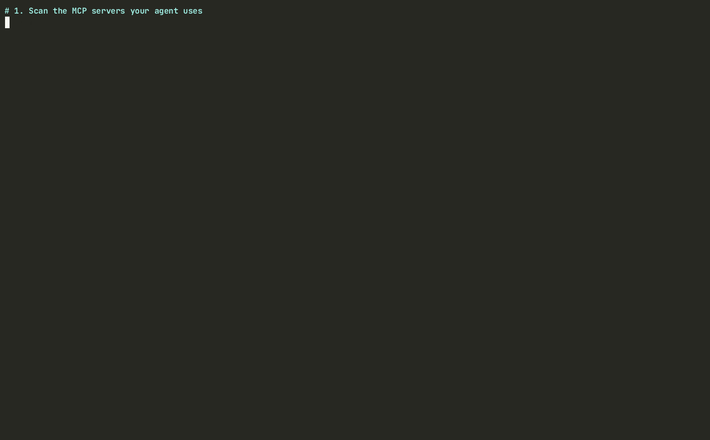

<div align="center">

# AgentGate

**Scan, lock, and gate your MCP servers — `npm audit` + lockfile + CI drift gate for the MCP era.**

[](https://github.com/wookat/agentgate/actions/workflows/ci.yml)
[](https://www.npmjs.com/package/mcp-agentgate)
[](LICENSE)
[](package.json)
[](https://modelcontextprotocol.io)

English | [简体中文](README.zh-CN.md)



</div>

<details><summary>Developing from source (contributors)</summary>

Requires Node.js >= 22 and [pnpm](https://pnpm.io).

```bash
git clone https://github.com/wookat/agentgate.git
cd agentgate
pnpm install
pnpm build

alias agentgate="node $PWD/packages/cli/dist/index.js"
```

Scan every MCP server your clients (Claude Desktop / Claude Code / Cursor / VS Code / Codex / OpenCode / Windsurf / Cline / Gemini CLI / Kiro / Roo Code / Zed / Continue.dev / Amp / Warp / LM Studio / Trae / Qoder) are configured to use — config paths are discovered automatically:

```bash
agentgate scan                 # static config analysis, terminal table
agentgate scan --live          # also connect to servers (stdio + remote) and audit their live tool surface
                               # (asks before starting them; add --yes in CI)
agentgate auth login <server>  # OAuth login for hosted servers — live scans pick up the cached tokens
agentgate scan --format json   # machine-readable report
agentgate scan --format sarif -o report.sarif   # for GitHub code scanning
agentgate scan path/to/repo    # scan an MCP server repo for source-level issues
agentgate scan path/to/repo --ignore 'vendor/**' 'test/**'   # exclude paths from repo scans
```

Add `--debug` to any command for diagnostics on stderr. Exit codes: `0` clean, `1` gate failure (drift / findings at `--fail-on`), `2` usage or environment error — see [docs/spec/cli-contract.md](docs/spec/cli-contract.md).

Pin the tool surface your agent sees, then gate on drift:

```bash
agentgate lock                 # connect to configured servers, write agentgate.lock
agentgate lock --skills        # also pin agent skill/instruction files (lockfile v2)
agentgate diff                 # exit 1 + human-readable diff if any tool name/description/schema changed
agentgate ci --fail-on high    # CI gate: drift OR high-severity findings → non-zero exit
```

Point at a specific config instead of auto-discovery with `--config path/to/mcp.json` (Codex `config.toml` and OpenCode `opencode.json` are also understood).

Twelve scan rules across seven categories, aligned with real-world MCP incidents: `tool-poisoning` (hidden Unicode, prompt injection — in tool descriptions and agent skill files), `credential-leak`, `overprivileged` (dangerous capability combos, unscoped skill `allowed-tools` grants), `auth-missing`, `ssrf`, `rce-vectors` (including load-time skill dynamic-context commands), `supply-chain` (unpinned `npx -y pkg@latest` rug-pull exposure).

Lockfile formats: [v1](docs/spec/lockfile-v1.md) (servers only, frozen) and [v2](docs/spec/lockfile-v2.md) (adds optional pinned skill files via `lock --skills`), with JSON Schemas in [docs/spec/](docs/spec/).

</details>

---

AgentGate is an open-source trust & supply-chain gate for
[Model Context Protocol](https://modelcontextprotocol.io) servers. Real incidents already
happened — the postmark-mcp BCC backdoor, mcp-remote RCE (CVE-2025-6514, CVSS 9.6),
and silent upstream "rug pulls" that change tool descriptions your agent reads live.
Existing tools cover one corner each ([comparison](docs/COMPARISON.md)); AgentGate closes
the whole loop in one tool:

| Step | What it does |
|---|---|
| **Scan** | Static + opt-in live analysis of MCP servers: tool poisoning (hidden Unicode, prompt injection), credential leaks, SSRF/RCE vectors, over-privileged tool combos |
| **Lock** | Pin the exact tool surface (names, descriptions, input schemas) your agent sees — and optionally every skill/instruction file (`--skills`) — into `agentgate.lock`: rug-pull defense |
| **Gate** | Fail CI on any drift from the approved baseline; diff-based review, not binary allow/deny |
| **Deps** | Catch AI-hallucinated (slopsquatted) and typosquatted dependencies — live npm/PyPI verification of manifests *and* source imports before anything installs |
| **Advise** | Cross-check servers against a [public, structured MCP advisory database](advisories/) |

## Quick start

The npm package is **`mcp-agentgate`** (the bare `agentgate` name was taken); the installed command is still **`agentgate`** (`npm i -g mcp-agentgate` → `agentgate scan`).

```bash
# Scan the MCP configs on this machine (Claude, Cursor, VS Code, Codex, OpenCode, Windsurf, Cline, Gemini CLI, Kiro, Roo Code, Zed, Continue.dev, Amp, Warp, LM Studio, Trae, Qoder auto-discovered)
npx mcp-agentgate scan

# Pin the current tool surface into agentgate.lock
npx mcp-agentgate lock

# In CI: exit non-zero if anything drifted from the lock
npx mcp-agentgate ci

# Catch AI-hallucinated (slopsquatted) and typosquatted dependencies (npm + PyPI)
npx mcp-agentgate deps

# Ask the MCP advisory database about a package before you install it
npx mcp-agentgate advisory check mcp-remote@0.1.10
```

All commands and exit codes: [docs/spec/cli-contract.md](docs/spec/cli-contract.md).
Docs, rule reference, and report viewer: **https://agentgate.zalize.com**.

## CI gate in one step

```yaml
# .github/workflows/mcp-gate.yml
steps:
  - uses: actions/checkout@v4
  - uses: wookat/agentgate/packages/action@v0.24.1
    with:
      command: ci
```

Findings show up inline on the PR diff automatically — under GitHub Actions, `ci`/`scan`/`deps` emit one workflow-command annotation per finding, no extra permissions needed. See [packages/action](packages/action/) for SARIF upload to GitHub code scanning and all inputs.

Or as a pre-commit hook:

```yaml
# .pre-commit-config.yaml
repos:
  - repo: https://github.com/wookat/agentgate
    rev: v0.24.1
    hooks:
      - id: agentgate-ci
```

## Compatibility

| Platform | Status |
| --- | --- |
| Linux | CI-verified on every PR (`ubuntu-latest`) |
| macOS | CI-verified on every PR (`macos-latest`) |
| Windows | CI-verified on every PR (`windows-latest`) |
| Node.js | >= 22 (enforced via `engines`) |

The full test suite — including a live stdio MCP fixture server — runs on all
three operating systems in CI. Client config discovery covers the
platform-specific paths of Claude Desktop, Claude Code, Cursor, VS Code, Codex,
OpenCode, Windsurf, Cline, Gemini CLI, Kiro, Roo Code, Zed, Continue.dev,
Amp, Warp, LM Studio, Trae, and Qoder on each OS.

## Config portability

Move your MCP server config between clients without retyping JSON/TOML by hand
(the official MCP 2026 roadmap names config portability as an open gap):

```bash
npx mcp-agentgate config convert --from cursor --to vscode --in .cursor/mcp.json --out .vscode/mcp.json
```

Supports Claude Desktop, Claude Code, Cursor, VS Code, Codex, OpenCode,
Windsurf, Cline, Gemini CLI, Kiro, Roo Code, Zed, Continue.dev, Amp, Warp, LM Studio, Trae, and Qoder, with
explicit warnings on any lossy conversion. Also available as the standalone
[mcp-agentgate-config-convert](packages/config-convert/) package.

## Why not just use a scanner (or just a lockfile)?

Scanners find known-bad patterns *at scan time* but can't see an approved server that
quietly changes next week. Lockfiles catch drift but don't judge whether what you locked
was safe to begin with. AgentGate does both, plus cross-checks a public advisory DB.
The full, source-verified feature matrix vs mcp-scan (now Snyk Agent Scan), Cisco MCP
Scanner, MCTS, ToolPin, mcp-warden, and both mcp-locks: **[docs/COMPARISON.md](docs/COMPARISON.md)**.

## Repository layout

```
packages/cli/            # agentgate CLI (scan / lock / diff / ci)        [route A]
packages/core/           # rule engine, lockfile spec implementation     [route A]
packages/action/         # GitHub Action                                 [route C]
packages/config-convert/ # MCP client config converter                   [route C]
advisories/              # public MCP advisory database (structured JSON)[route B]
website/                 # docs site + report viewer (Cloudflare Pages)  [route B]
docs/                    # specs and project docs
```

## Security

See [SECURITY.md](SECURITY.md) for the vulnerability disclosure process. CI actions are
SHA-pinned, dependencies are frozen-lockfile installed, releases ship with npm
provenance, and AgentGate scans itself in CI ([dogfood job](.github/workflows/ci.yml)).

## Contributing

PRs welcome. Cross-cutting interfaces (CLI JSON output, advisory schema, lockfile
schema) live in [docs/spec/](docs/spec/) — update the spec in the same PR as the code.

## License

[Apache-2.0](LICENSE)
